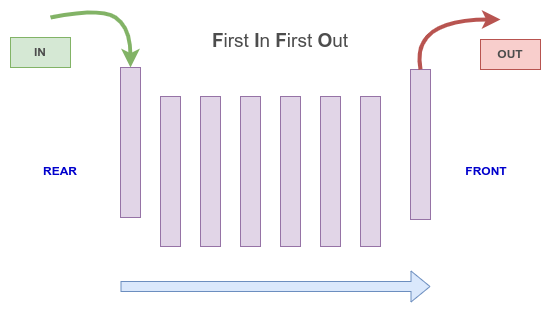

# Queues

## What is a Queue?
A queue is a data structure that uses the First In First Out (FIFO) approach (*see image below*) to store items in a linear order. Just like a line in a bank, the first to arrive is the first to be attended, in other words, "the least recently added item is removed first" (1).



## When to use a Queue?
It's important to first understand that queues are everywhere, we might not notice it due to all the abstraction that we have in our software and programming languages. Here are some examples:
* Scheduling asynchronous threads to be executed (in our applications)
* Operating systems use queues to organize their processes
* Servers receive requests and organize them in queues

In other words, anytime you need to work with things in a first in, first out system, a queue is your data structure to go.

## Options of Queues in Python?
There are many alternatives of approaches to work with Queues in Python, among them the most common are:

|   Strategy  |   Efficiency    |   Advantage
| :-----:     | :------------:  | :------------:
|  List       |     O(n)        | It's very simple to implement a List
|  Deque      |     O(1)        | It has a great performance without adding much difficulties
|  Own class  |     O(1)*       | It allows for complete control of methods

**It will depand on implementation but usually it can be done with a O(1) time complexity.*
<br/><br/>

Creating your own class is a very cumbursome alternative, despite being very efficient. But since we have simpler alternatives we will not discuss it in this tutorial.

So, let's discuss the two other alternatives suggested.

### About Time Complexity
It's also important to emphasize that although using a List is simple to implement and to work, there is a problem of efficiency. Because whenever you add a new item to the List, since Lists use indexes, the List will need to update all the indexes of all the items of the List. That gives a List a O(n) efficiency.

Now, because a deque does not face the same problem of needing to update indexes, its time complexity is O(1). In a deque, an item is added directly to its rear and we can pop it directly from its front.

## Implementing a Queue
### With List
As simple as a List.
```python
# We can initialize a queue by creating a simple list
queue = []
```

### With Deque
We need to import the Deque from Collections and then just instantiate the Class.
```python
# We will need to import Deque from Collections
from collections import deque

# Then we can initialize our queue
queue = deque()
```
## Enqueue
### With List
Adding an item to a queue is called enqueuing. To do it with our List we're going to use the `.append()` method.
```python
queue = []

# Use the 'append()' method to enqueue a new item to the rear of your queue
queue.append("Adam")
queue.append("Brandon")
queue.append("Carl)
```
### With Deque
Lists and Deques use the same method to enqueue a new item.

```python
from collections import deque

queue = deque()

# Use the 'append()' method to enqueue a new item to the rear of your queue
queue.append("Adam")
queue.append("Brandon")
queue.append("Carl)
```

## Dequeue
### With List
Removing an item from a queue is called dequeing. We do it with the `.pop(0)` method for it. **Important:** we need to use the index 0 when popping so we grab the first item in the List.
```python
queue = []

queue.append("Adam")
queue.append("Brandon")
queue.append("Carl")

# Use the 'pop()' method, passing the index 0, to dequeue an item from the front of your queue

first_client = queue.popl(0) # Adam
second_client = queue.popl(0) # Brandon
third_client = queue.popl(0) # Carl
```
### With Deque
With a deque we're going to use the `.popleft()` method to deque.  **Important:** there is no index here.

**Important:** we want to remove the item on the front of our queue, that's why we can't use the `.pop()` method, that would remove the item from the gear - the last one added.

```python
from collections import deque

queue = deque()

queue.append("Adam")
queue.append("Brandon")
queue.append("Carl")

# Use the 'popleft()' method to dequeue an item from the front of your queue
first_client = queue.popleft() # Adam
second_client = queue.popleft() # Brandon
third_client = queue.popleft() # Carl
```


## Length
We can find out the length of our queue - both for List and for Deque - by using the `len()` function. See examples below.
### With List
```python
queue = []

print(len(queue)) # Should print 0 (zero)

queue.append("Adam")
queue.append("Brandon")
queue.append("Carl")

print(len(queue)) # Should print 3 (three)
```
### With Deque

```python
from collections import deque

queue = deque()

print(len(queue)) # Should print 0 (zero)

queue.append("Adam")
queue.append("Brandon")
queue.append("Carl")

print(len(queue)) # Should print 3 (three)
```
## Example
In Brazil, when we go to the doctor (public healthcare) we register our names and general health issues with a receptionist, than we need to wait our names to be called as soon as the doctor is available for us.

We can use Python and queues to implement the system that calls the patient's name, and it could look something like this:

*We're using a List for our example, but you could also implement it with a Deque*


```python
patients_waiting = []

# John arrives to be attended
new_patient = "John Atkins"

# Add John to the waiting list
patients_waiting.append(new_patient)

# Mary arrives to be attended
new_patient = "Mary Benson"

# Add Mary to the waiting list
patients_waiting.append(new_patient)


# A loop would check when the doctor is available
# When that happens, the first in line will be called.
next_patient = patients_waiting.pop(0)
print(next_patient + " go to Room #01")  # John should be called first

```

## Problem to Solve
During the Pandemics some stores in China created a digital list of the clients to be attended next and sent them a text message on their phones as soon as it was their time to be attended.

Create a simple program that simulates the behavior of registering a new client and then sending him a message when it's his turn to be attended.


**After you have your own solution you can compare it with the proposed one: [Solution](queue_problem_solution.py)**

## References to Further Study
1. Queue in Python - https://www.geeksforgeeks.org/queue-in-python/
2. Stacks and Queues in Python - https://stackabuse.com/stacks-and-queues-in-python/
3. Queue — A synchronized queue class - https://docs.python.org/3/library/queue.html
4. To Queue Or Not To Queue - https://medium.com/basecs/to-queue-or-not-to-queue-2653bcde5b04

[Back to Welcome Page](0-welcome.md)


