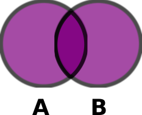
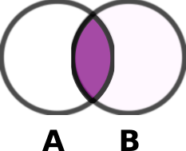
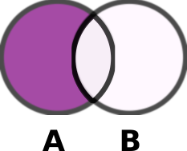
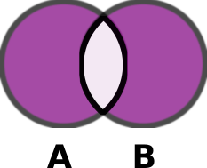

# Sets
## What is a Set?
A set is one of the built-in data structures of python. It creates a collection of unordered items, this collection is partially immutable/unchangeable - this means that "once a set is created, you cannot change its items, but you can remove items and add new items"(1) to the set.

In a set, the elements can also not be duplicated - in other words, each element in the collection is unique.

## When to use a Set?
Since sets only contain unique items, they are useful for mathematical sets, so we can use them whenever we need to work with mathematical operations like union, intersection and difference, for example.

Furthermore a set has a much better method (more optimized) for checking if a specific element is within our set. So there might be cases when you might opt for a Set instead of List so you can use this method.

## Implementing a Set
We can create python by using the built-in `set()` function and then passing the list of items separated by a comma.

Example:

```python
fruits = set(['apple', 'banana', 'cherries'])
```
Or we can create a set by simply placing all our elements inside curly braces `{}`, the items also must be separated by commas.

Example:

```python
fruits = {'apple', 'banana', 'cherries'}
```
### Multiple Datatypes
 An important peculiarity to emphasize about Python Sets is the fact that you can create sets with a mix o different datatypes.

Example:

```python
mom_info = {'Mom', True, 51, (6, 8, 11), 9.32}
```
### No Indexes
Set does not support indexing. So we can not try to retrieve an item for any given position. Remember, we're talking of an unordered collection.
```python
fruits = {'apple', 'banana', 'cherries'}

# So if we try to use index to retrieve any of the items, we're going to face an error:
fruits[1]
# TypeError: 'set' object is not subscriptable

```

## Time complexity
On its core, a Set is implemented as a hash table, the big difference is that it does not use the `key: value` organization that a dictionary would require. That means that most of the Sets methods, add, remove, copy, etc, are of an O(1) time complexity. An exception would be when we need to loop through a set, which would become a O(n) time complexity.

Examples:

| Operation     | Time Complextiy |
|---------------|-----------------|
|  Add          | O(1)            |
|  Remove       | O(1)            |
|  Clear        | O(1)            |
|  Pop          | O(1)            |
|  Iteration*   | O(n)            |

**Complexity may depend on the length of the Set*

### Time Complexity for Set Operation
If you want deeper information on how Big O Notation is evaluated for sets when they are used for Mathematical Set Operations, it's worth to access the documentation available at:

https://wiki.python.org/moin/TimeComplexity

Here's a peek on an excellent table they created to examplify (please read the full article there for all the details):

| Operation                          | Average case          | Worst Case                                    | notes                                      |
|------------------------------------|-----------------------|-----------------------------------------------|--------------------------------------------|
|  x in s                            | O(1)                  | O(n)                                          |                                            |
|  Union s\|t                        | O(len(s)+len(t))      |                                               |                                            |
|  Intersection s&t                  | O(min(len(s), len(t)) | O(len(s) * len(t))                            | replace "min" with "max" if t is not a set |
|  Multiple intersection s1&s2&..&sn |                       | (n-1)*O(l) where l is max(len(s1),..,len(sn)) |                                            |
|  Difference s-t                    | O(len(s))             |                                               |                                            |
|  s.difference_update(t)            | O(len(t))             |                                               |                                            |
|  Symmetric Difference s^t          | O(len(s))             | O(len(s) * len(t))                            |                                            |
|  s.symmetric_difference_update(t)  | O(len(t))             | O(len(t) * len(s))                            |                                            |

**Important: this table is part of external documentation (see link above for details)*

## Common Methods - Sample Code

### Adding an Item
```python
fruits = {'apple', 'banana', 'cherries'}
fruits.add('orange')
# After Method: {'apple', 'banana', 'cherries', 'orange'}
```
**Time Complexity:** Big O notation of O(1) 
### Removing an Item

```python
fruits = {'apple', 'banana', 'cherries'}
fruits.remove('banana')
# After Method: {'apple', 'cherries'}
```
**Time Complexity:** Big O notation of O(1) 
### Clearing the Set
```python
fruits = {'apple', 'banana', 'cherries'}
fruits.clear()
# After Method: set()
```
**Time Complexity:** Big O notation of O(1) 
### Retrieving a Random Element
```python
fruits = {'apple', 'banana', 'cherries'}
random_fruit = fruits.pop()
print(random_fruit)
# Output: Each time may print a different (random fruit)
```
**Time Complexity:** Big O notation of O(1) 
### Length of the Set
```python
fruits = {'apple', 'banana', 'cherries'}
print(len(fruits))
# Output: 3
```
**Time Complexity:** Big O notation of O(1)
### Iterating through a Set
```python
fruits = {'apple', 'banana', 'cherries'}
for fruit in fruits:
    print(fruit)
# Output:
#   apple
#   banana
#   cherries
```
**Time Complexity:** may reach a Big O notation of O(n) depending on length, but for the scenario above it would be just O(1).

## Math Set Operations
### Union
A union B, is the set of all values that are a member of A, or B, or both.


```python
fruits = {'apple', 'banana', 'cherries'}
vegetables = {'carrot', 'brocolli', 'lettuce'}
fruits_and_vegetables = fruits.union(vegetables)
# New set: {'lettuce', 'cherries', 'brocolli', 'apple', 'banana', 'carrot'}
```
### Intersection
A intersection B, is the set of all values that are a member of both A and B.


```python
fruits = {'apple', 'banana', 'cherries', 'tomatoes'}
vegetables = {'tomatoes', 'carrot', 'brocolli', 'lettuce'}
fruits_and_vegetables = fruits.intersection(vegetables)
# New set: {'tomatoes'}
```

### Difference
A difference B, is the set of all values of A that are not members of B.


```python
fruits = {'apple', 'tomatoes'}
vegetables = {'tomatoes', 'carrot'}
fruits_and_vegetables = fruits.difference(vegetables)
# New set: {'apple'}
```

### Symmetric Difference
A symmetric difference B, is the set of all values which are in one of the sets but not in both.


```python
fruits = {'apple', 'tomatoes'}
vegetables = {'tomatoes', 'carrot'}
fruits_and_vegetables = fruits.symmetric_difference(vegetables)
# New set: {'apple', 'carrot'}
```

## Example
Some text

## Problem to Solve
Some text


```python
# Some code example
```


After you have your own solution you can compare it with the proposed one: [Solution](module_02.py)

## References to Further Study
1. Python Sets - https://www.w3schools.com/python/python_sets.asp
2. *Principais Estruturas de Dados no Python* - https://www.treinaweb.com.br/blog/principais-estruturas-de-dados-no-python
3. Time Complexity - https://wiki.python.org/moin/TimeComplexity


[Back to Welcome Page](0-welcome.md)
