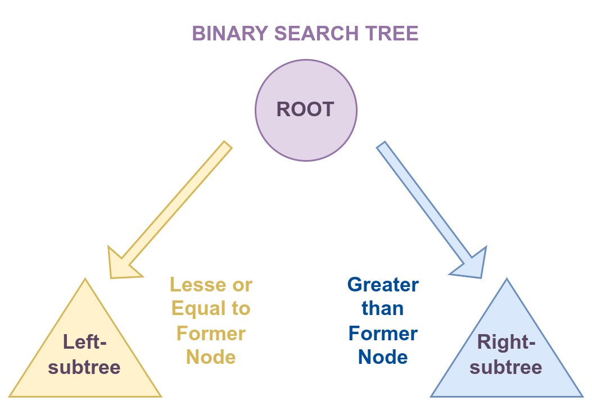
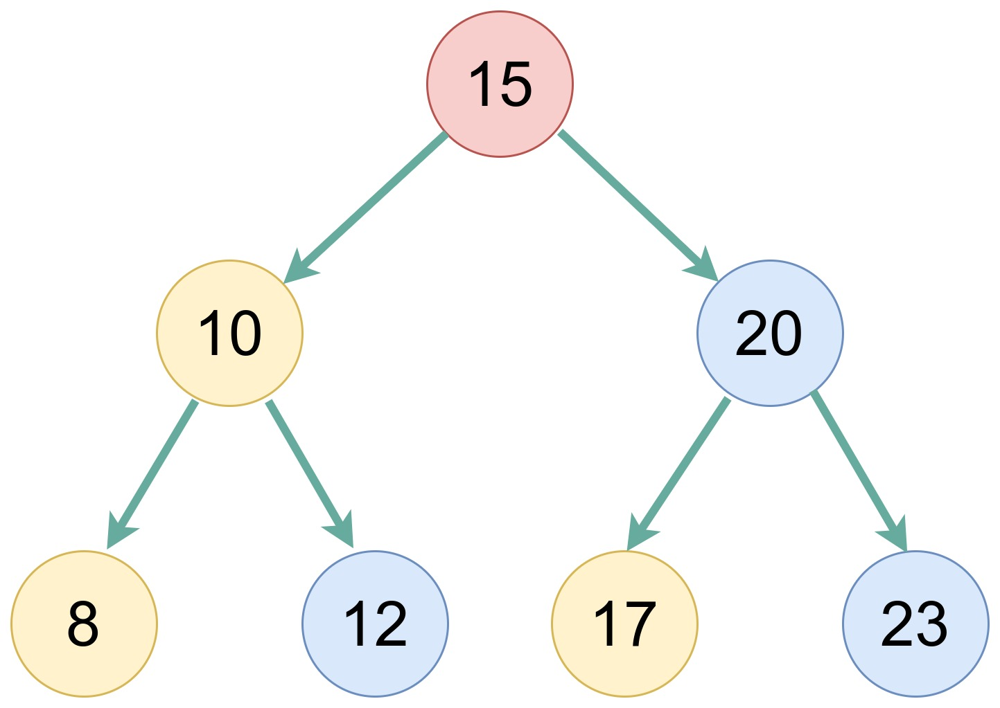

| [<< Go to Sets](2-sets.md) | [Go to Conclusion >>](4-conclusion.md)  |
|--------------------------------|-------------------------------|
# Trees

## What is a Tree?
A tree is a Python data structured very closely related to a linked list. Both are going to have elements that are called (or could be called nodes).

Something relevant about a tree is that it creates a hierarchical structure on a collection of items, the biggest difference between a tree and a linked list is that the tree "has two 'next pointers', or as we label them in the class, a 'left' and 'right' next pointer". (3)

## Binary Search Tree (BST)
A binary search tree is a binary tree where every child node - also called subtree - to the left is less than the parent node, and the child node (or subtree) to the right is greater than the parent node.

Visual Representation:



Example:



## When to Use a BST?
Because a binary search tree has excellent performance for searching, inserting and removing data to its collection, a BTS is useful for all sorts of large collection of ordered data, being numeric or alphabetic.

### Time Complexity
Here is a comparison of the 3 forementioned operations (search, insert, and remove) using different data structures.

|               | Array (unsorted) | Linked List | Array (sorted) | BST (balanced) |
|---------------|------------------|-------------|----------------|----------------|
| Search (x)    |  O(n)            | O(n)        | O(log n)       | O(log n)       |
| Insert (x)    |  O(1)            | O(1)        | O(n)           | O(log n)       |
| Remove (x)    |  O(n)            | O(n)        | O(n)           | O(log n)       |

It's important to emphasize that this are Big O notations for complex scenarios, and that our BST is properly balanced.

## Implementing a BST
When implementing a BST and its operations, it's necessary to understand that these operations will require recursive work.

### The Bare Minimum about Recursion
To work with recursion we need to find a base case - or stopping condition - for our recursive call to come back to. Each call must simplify or progress through the problem, this will allow us not to get stuck in an infinite loop.

## BST Operations
This implementation was proposed by BYU Idaho study guides.

Notice that for each operations there is a bese case and recursion is used to allow us to act, depending on the operation, to add, search or remove an item to its proper position.

### Creating our Own Class
The add/insert and search/contain operations are exemplified here:

```python
class BST:
    class Node:
        def __init__(self, data):
            self.data = data
            self.left = None
            self.right = None

    def __init__(self):
        self.root = None

    def insert(self, data):
        if self.root is None:
            self.root = BST.Node(data)
        else:
            self._insert(data, self.root)  # It's important to start at the root

    def _insert(self, data, node):
        # Left side
        if data < node.data:
            if node.left is None: # Base case
                node.left = BST.Node(data)
            else:                 # Recursion
                self._insert(data, node.left)

        # Right side
        elif data > node.data:
            if node.right is None:
                node.right = BST.Node(data)
            else:
                self._insert(data, node.right)

    def __search__(self, data):
        return self._search(data, self.root)  # It's important to start at the root

    def _search(self, data, node):
        if node is not None:
            if data == node.data:
                return True
            return self._search(data, node.left)
            return self._search(data, node.right)
```

## Example
Nick Fury has been assemblying an amazing group of friends to watch out for danger around there. But the number of friends is growing too fast and he is having a hard time remembering everybody's name, so he wants an application that allows him to easily store their names. It must be fast though, because whenever he needs the info, it mus be easily accessible.

### Code
We're not copying the whole class again for this example, but it's important to understand that the class for our BST must be available in order for the rest of the code to funcion properly.

```python
# The BST Class is provideded on lines before this code
# We're not repeating everything here for simplicity (you will need to have it on your code though)

# Create a tree
avengers = BST()

# Insert some initial data
avengers.insert("Captain America")
avengers.insert("Iron Man")
avengers.insert("Hulk")
avengers.insert("Black Widow")

# Ask for new insert
print("Please provide the name of the new avenger")
new_avenger = input("Enter new avenger name: ")

avengers.insert(new_avenger)

# Check whether avenger is in list
searched_avenger = input("Enter avenger name to check: ")
if searched_avenger in avengers:
    print(searched_avenger + " is already in the list.")
else:
    print(searched_avenger + " is NOT in the list yet. Please add him/her")

```
## Problem to Solve
Now you need to write a program for a school to keep track of the name of all the students who enlist to study there.

You can follow the same pattern we had before.

Please provide the total number of students after the insertion.


**After you have your own solution you can compare it with the proposed one: [Solution](bst_problem_solution.py)**

## References to Further Study
1. Data structures: Binary Search Tree - https://youtu.be/pYT9F8_LFTM
2. Binary Search Tree - https://youtu.be/ovWqEgYYAEQ
3. Tress - http://bhattaca.github.io/cse2122/lecture/trees.html

[Back to Welcome Page](0-welcome.md)

| [<< Go to Sets](2-sets.md) | [Go to Conclusion >>](4-conclusion.md)  |
|--------------------------------|-------------------------------|